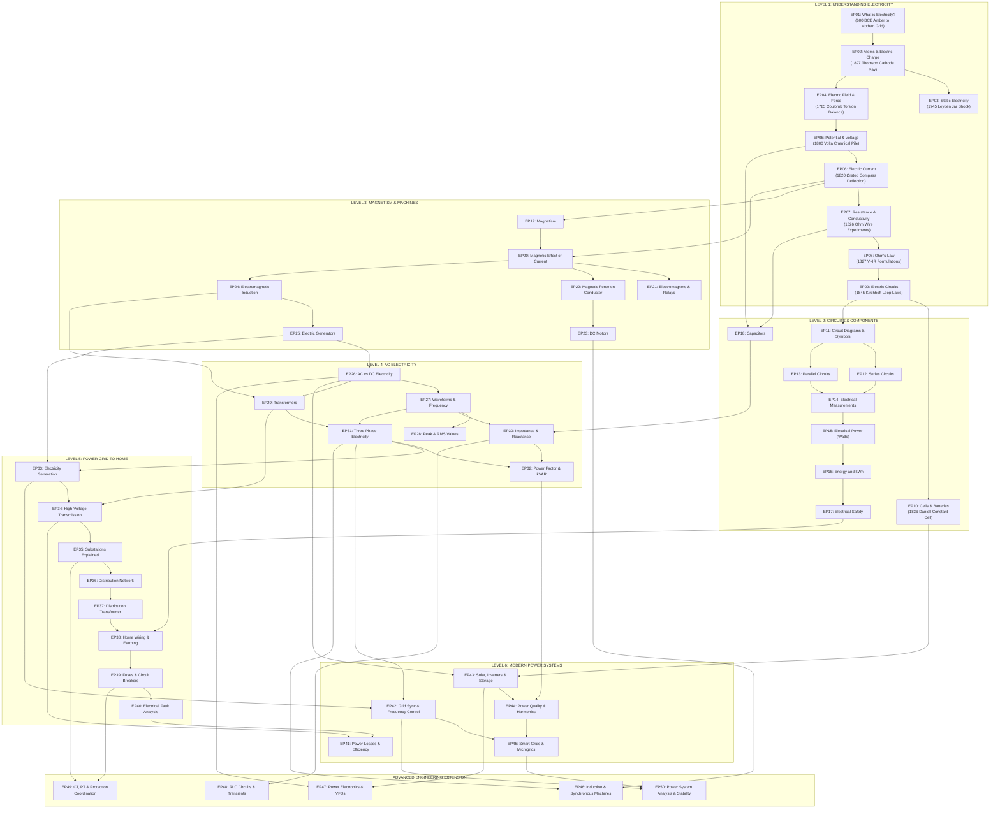

# 🗺️ EPISODE DEPENDENCY MAP & HISTORICAL BRIDGES

```mermaid
flowchart TD
    subgraph L1["LEVEL 1: UNDERSTANDING ELECTRICITY"]
        EP01["EP01: What is Electricity?<br/>(600 BCE Amber to Modern Grid)"] --> EP02["EP02: Atoms & Electric Charge<br/>(1897 Thomson Cathode Ray)"]
        EP02 --> EP03["EP03: Static Electricity<br/>(1745 Leyden Jar Shock)"]
        EP02 --> EP04["EP04: Electric Field & Force<br/>(1785 Coulomb Torsion Balance)"]
        EP04 --> EP05["EP05: Potential & Voltage<br/>(1800 Volta Chemical Pile)"]
        EP05 --> EP06["EP06: Electric Current<br/>(1820 Ørsted Compass Deflection)"]
        EP06 --> EP07["EP07: Resistance & Conductivity<br/>(1826 Ohm Wire Experiments)"]
        EP07 --> EP08["EP08: Ohm's Law<br/>(1827 V=IR Formulations)"]
        EP08 --> EP09["EP09: Electric Circuits<br/>(1845 Kirchhoff Loop Laws)"]
    end

    subgraph L2["LEVEL 2: CIRCUITS & COMPONENTS"]
        EP09 --> EP10["EP10: Cells & Batteries<br/>(1836 Daniell Constant Cell)"]
        EP09 --> EP11["EP11: Circuit Diagrams & Symbols"]
        EP11 --> EP12["EP12: Series Circuits"]
        EP11 --> EP13["EP13: Parallel Circuits"]
        EP12 & EP13 --> EP14["EP14: Electrical Measurements"]
        EP14 --> EP15["EP15: Electrical Power (Watts)"]
        EP15 --> EP16["EP16: Energy and kWh"]
        EP16 --> EP17["EP17: Electrical Safety"]
        EP05 & EP07 --> EP18["EP18: Capacitors"]
    end

    subgraph L3["LEVEL 3: MAGNETISM & MACHINES"]
        EP06 --> EP19["EP19: Magnetism"]
        EP19 & EP06 --> EP20["EP20: Magnetic Effect of Current"]
        EP20 --> EP21["EP21: Electromagnets & Relays"]
        EP20 --> EP22["EP22: Magnetic Force on Conductor"]
        EP22 --> EP23["EP23: DC Motors"]
        EP20 --> EP24["EP24: Electromagnetic Induction"]
        EP24 --> EP25["EP25: Electric Generators"]
    end

    subgraph L4["LEVEL 4: AC ELECTRICITY"]
        EP25 --> EP26["EP26: AC vs DC Electricity"]
        EP26 --> EP27["EP27: Waveforms & Frequency"]
        EP27 --> EP28["EP28: Peak & RMS Values"]
        EP24 & EP26 --> EP29["EP29: Transformers"]
        EP27 & EP18 --> EP30["EP30: Impedance & Reactance"]
        EP27 & EP29 --> EP31["EP31: Three-Phase Electricity"]
        EP30 & EP31 --> EP32["EP32: Power Factor & kVAR"]
    end

    subgraph L5["LEVEL 5: POWER GRID TO HOME"]
        EP25 & EP31 --> EP33["EP33: Electricity Generation"]
        EP29 & EP33 --> EP34["EP34: High-Voltage Transmission"]
        EP34 --> EP35["EP35: Substations Explained"]
        EP35 --> EP36["EP36: Distribution Network"]
        EP36 --> EP37["EP37: Distribution Transformer"]
        EP37 & EP17 --> EP38["EP38: Home Wiring & Earthing"]
        EP38 --> EP39["EP39: Fuses & Circuit Breakers"]
        EP39 --> EP40["EP40: Electrical Fault Analysis"]
    end

    subgraph L6["LEVEL 6: MODERN POWER SYSTEMS"]
        EP34 & EP40 --> EP41["EP41: Power Losses & Efficiency"]
        EP33 & EP31 --> EP42["EP42: Grid Sync & Frequency Control"]
        EP26 & EP10 --> EP43["EP43: Solar, Inverters & Storage"]
        EP32 & EP43 --> EP44["EP44: Power Quality & Harmonics"]
        EP42 & EP44 --> EP45["EP45: Smart Grids & Microgrids"]
    end

    subgraph EXT["ADVANCED ENGINEERING EXTENSION"]
        EP31 & EP23 --> EP46["EP46: Induction & Synchronous Machines"]
        EP43 & EP26 --> EP47["EP47: Power Electronics & VFDs"]
        EP30 --> EP48["EP48: RLC Circuits & Transients"]
        EP35 & EP39 --> EP49["EP49: CT, PT & Protection Coordination"]
        EP42 & EP45 --> EP50["EP50: Power System Analysis & Stability"]
    end
```
